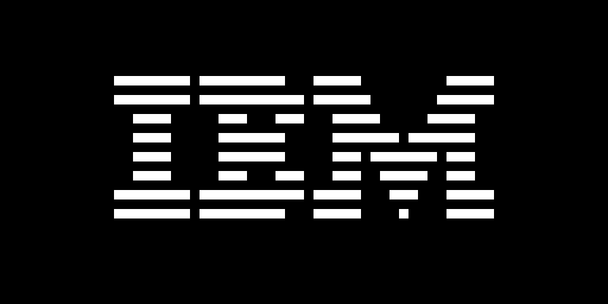

This repo is a WIP implementation of the [CHIP-8](https://en.wikipedia.org/wiki/CHIP-8) in [Odin](https://odin-lang.org/).

As of the time of this writing (4/14/24), the emulator has just enough instructions to run the IBM logo test (included).

This project utilizes [Raylib](https://www.raylib.com/) for windowing and drawing.

Rendering and emulation are implemented as separate threads with the pixel buffer data being sent from the "core" to the render thread over a [`sync/chan`](https://github.com/odin-lang/Odin/blob/master/core/sync/chan/chan.odin) (similar to goroutine channels).

The pixel buffer is represented as a two dimensional array of booleans (`[32][64]bool`) to match the native resolution of the CHIP-8. This resolution gets upscaled 16x at draw time in the render thread.

Pressing `q` will close the program.

